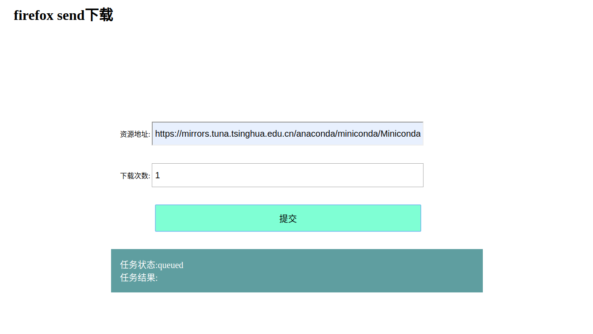
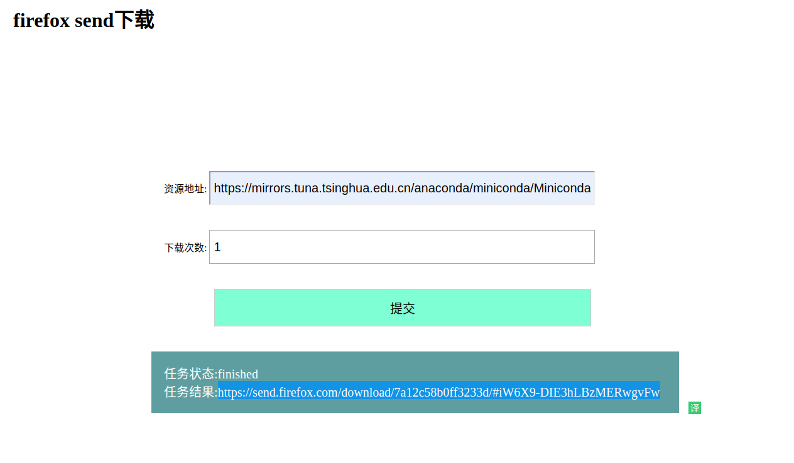

## 使用场景

国内访问国外的带宽极低的情况下（比如我的电信宽带，一到晚上的高峰期访问国外的资源只有10KB/s左右的速度)，并且你有一个位于国外的服务器。可以将该服务部署到服务器上，由它帮助你下载指定的大文件资源并且生成速度更快的下载链接。

下载链接是由`https://send.firefox.com`提供的文件分享功能。

## 编译

```shell
make build
```


## 打包镜像

```shell
make docker build
```

## 使用docker 运行

```
docker run -d -p 8080:8080 --name ffdownload joyme/ffdownload:1.0 
```

在浏览器中打开地址: `localhost:8080`, 出现以下的界面



然后提交资源地址和资源可下载的次数，下载完成后生成一个高速的下载链接(由https://send.firefox.com提供):

